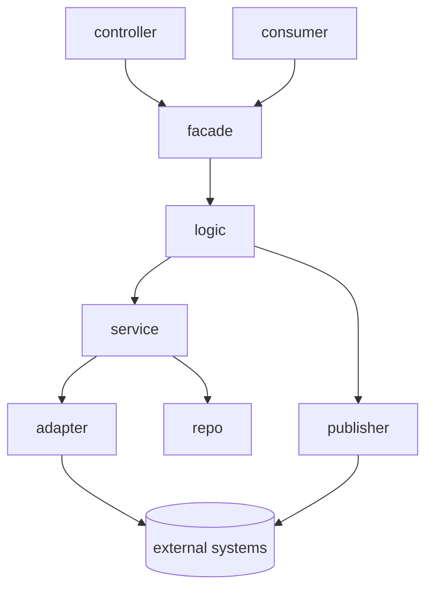

# Project Structure

Adopt a domain-driven layout with eight explicit layers. Keep each layer in its own directory and limit cross-layer communication to the flow described below.

- **controller** — entry points (HTTP routes, middleware) that translate external requests into domain calls and shape responses.
- **consumer** — inbound event handlers for queues, topics, or cron triggers that normalize payloads and pass them to facades.
- **facade** — validators, orchestration logic, and the selector that chooses which domain logic to execute; this is the only layer controllers or consumers call.
- **logic** — pure business rules; no IO or framework code. Functions take validated inputs and return deterministic results while deciding whether to engage services or publishers.
- **service** — domain-oriented orchestration that coordinates data persistence, caching, cross-service calls, and shapes data before handing it to downstream integrations.
- **adapter** — external integration layer (third-party APIs, messaging, platform SDKs) that operates at the same level as repos and accepts only sanitized, service-prepared payloads while conforming external responses into domain-friendly shapes.
- **publisher** — outbound event emitters that translate domain models into integration-specific payloads for queues, topics, or webhooks.
- **repo** — raw database interfaces and query builders (SQL, NoSQL, ORM mappers). Expose primitive operations consumed by the service layer.

## Layer Diagram

## Dependency Rules
- Controllers may depend only on facades.
- Consumers may depend only on facades.
- Facades may call only logic.
- Logic may orchestrate services and publishers but stays free of framework code.
- Services depend on repos for persistence and are the only layer that may call adapters. They must shape and validate data before invoking adapters so the integration layer never receives raw inputs.
- Adapters communicate with external systems, returning normalized data back through services so logic stays insulated from integration details.
- Publishers wrap outbound integrations and receive only domain models or DTOs from logic.
- Same-layer modules must not depend on each other; keep boundaries strict to avoid circular coupling.
- Lower layers never reach upward—repos cannot call services, services cannot invoke facades, etc. Enforce this rule via reviews and static analysis.

## Data Model Types
- **entity** — mirrors the database schema exactly, including column names and types. Use entities only within the repo layer or when persisting data.
- **dto** — request/response payload shapes exposed at the edge (controllers, external APIs). Keep them immutable and versioned when contracts change.
- **model** — domain-specific objects tailored to business logic needs. Create models in the logic layer to abstract multiple entities or enrich data for decision making.

Map between these forms explicitly: controllers and consumers convert DTOs or event payloads to models via facades/logic, logic invokes services that translate models to entities for storage, publishes outbound DTOs through publishers, and repos return entities that upstream layers adapt back into models or DTOs as needed. Services also reshape domain models into adapter-ready DTOs before invoking integrations and translate responses back into domain-safe models so logic never couples to external schemas.
- Repos interact with databases or query builders; they should expose the minimal surface required by services.

Enforce this dependency direction in reviews and automate boundary checks (lint rules, module boundaries) wherever tooling allows.

## Data Access and Transactions
- Default read-only API flows (`get*`, `find*`, `list*`) to **read-uncommitted** isolation so callers are never blocked by in-flight writes. Apply the necessary query hints or connection-level settings in the repo layer and document any datastore-specific caveats.
- Wrap every create, update, or delete operation in an explicit transaction managed by the service layer. Keep the transaction scope tight, ensure all participating repo calls share the same context, and roll back on any failure to preserve atomicity.
- Surface transaction boundaries through well-named helpers so reviewers can audit that writes are protected while read operations remain lock-free.
